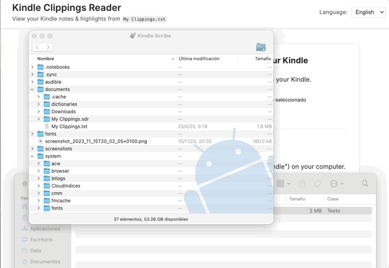

# 📚 Kindle Clippings Reader

A lightweight, open-source HTML app to read and manage your Kindle highlights and notes directly from the `My Clippings.txt` file.

- 📂 **100% local** — your data never leaves your device.
- ✍️ Copy all your notes in clean **Markdown** format.
- ⚡ **No installation needed** — just download and open in your browser.
- 🔎 **Search and filter** your books with ease.

> Perfect for readers who want to organize their Kindle annotations without relying on cloud services or third-party apps.

## ✨ Demo

---

## 🚀 How to Use

### 1️⃣ Connect Your Kindle
1. Power on your Kindle device.
2. Use a USB cable to connect it to your computer.
3. Your Kindle will appear as an external drive (usually named `Kindle`).

### 2️⃣ Locate the `My Clippings.txt` File
1. Open the **Kindle drive**.
2. Navigate to the `Documents` folder.
3. Find the file named **`My Clippings.txt`**.

### 3️⃣ Copy the File
- Copy `My Clippings.txt` into the same folder where `index.html` is located.
- Open `index.html` directly in your browser — **no web server required**.

✅ The app will automatically load your highlights for private, offline use.

---

## 🌐 Prefer a Hosted Version?
You can also use the app online at:

**➡️ [https://kindle-clippings-reader.vercel.app/](https://kindle-clippings-reader.vercel.app/)**

Even though it runs in your browser, **all processing is done locally**.  
No data from your `My Clippings.txt` file is ever sent over the network.

---

## 🔒 Privacy First
This app is designed with privacy in mind:
- All processing happens **locally in your browser**.
- You can run it **offline** by simply opening `index.html`.
- Ideal if you're concerned about sharing your reading habits or personal notes with cloud services.

---

## 💡 Notes
- The `My Clippings.txt` file includes all your Kindle highlights, notes, and bookmarks.
- It captures annotations from both **purchased books** and **personal documents**.
- Every time you add new highlights, this file updates — so remember to recopy it when needed.

---

## ⚠️ Troubleshooting
- If you don't see `My Clippings.txt`, ensure you've made at least **one highlight or note** on your Kindle.
- The file is always located in the `Documents` folder of your Kindle.

---

## 📜 License
This project is licensed under the [MIT License](https://choosealicense.com/licenses/mit/).